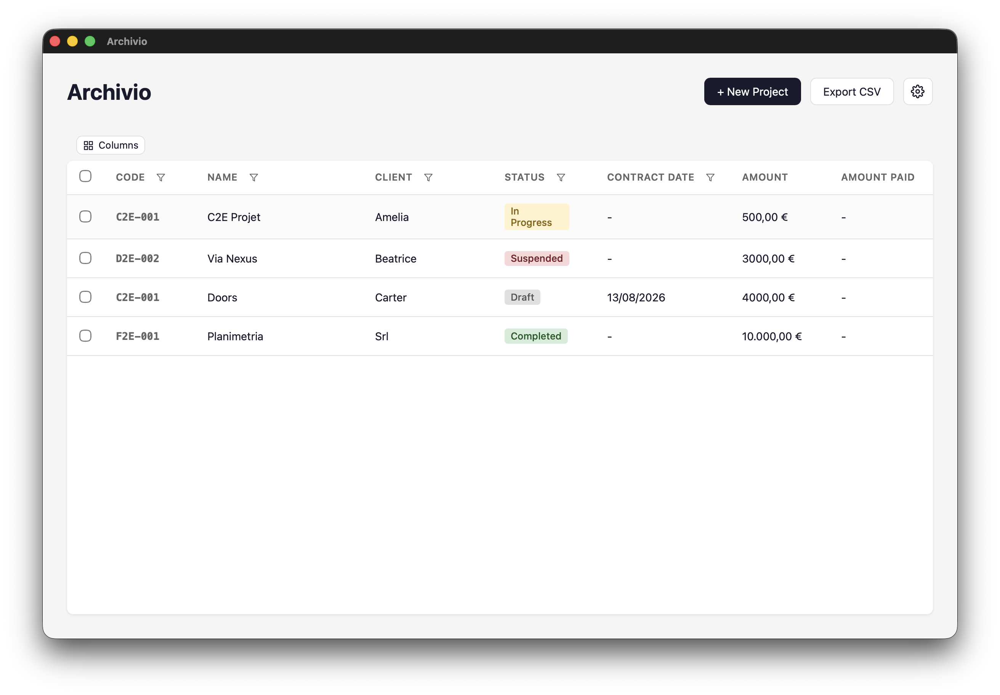
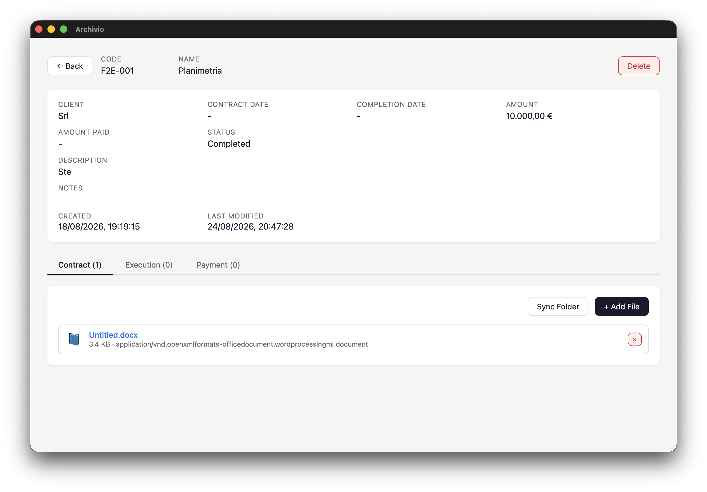
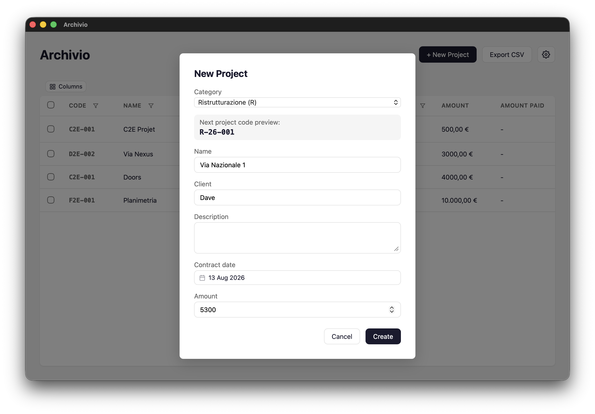

# Archivio

Desktop application for managing and archiving project documents. Built with [Tauri 2](https://v2.tauri.app/) (Rust + React).



## Features

- **Data table** — sortable, filterable project table with inline cell editing (pencil on hover)
- **Column visibility** — show/hide columns via a column picker toolbar
- **CSV export** — export all or selected rows to CSV
- **Row selection** — checkbox column for bulk selection
- **Categories** — define project categories with prefix codes; auto-generates sequential project codes (e.g. ED-24-001)
- **Project phases** — Contratto, Esecuzione, Pagamento, each with its own folder structure
- **File management** — add, remove, and sync files per phase
- **Photo support** — EXIF extraction (camera, date, GPS) and automatic thumbnail generation
- **Folder sync** — detect files added directly to the project folder on disk
- **Click to open** — click a file name to reveal it in the system file manager
- **Internationalization** — Italian and English UI (switchable from settings)
- **Cross-platform** — runs on Windows, macOS, and Linux

### Screenshots

| Dashboard | Project Detail | New Project |
|-----------|---------------|-------------|
|  |  |  |

## Installation

Download the latest installer from [Releases](https://github.com/DanielMangiagli/archivio/releases). Double-click the `.msi` or `.exe` to install.

## Development

### Prerequisites

- [Node.js](https://nodejs.org/) v24+
- [Rust](https://rustup.rs/) (stable)
- Platform-specific dependencies for Tauri — see the [Tauri prerequisites guide](https://v2.tauri.app/start/prerequisites/)

### Getting Started

```bash
npm install
npm run dev
```

### Building

```bash
# Production build (creates installer in src-tauri/target/release/bundle/)
cargo tauri build
```

The build output depends on your platform:
- **macOS**: `.dmg` and `.app` in `src-tauri/target/release/bundle/dmg/`
- **Windows**: `.msi` and `.exe` in `src-tauri/target/release/bundle/msi/` and `nsis/`
- **Linux**: `.deb` and `.AppImage` in `src-tauri/target/release/bundle/`

### Releasing

A GitHub Actions workflow automatically builds a Windows installer when you push a version tag:

```bash
git tag v1.1.0
git push --tags
```

The `.msi` and `.exe` installers will be available in the GitHub Releases page.

## Project Structure

```
archivio/
├── frontend/                     # React + Vite frontend
│   ├── src/
│   │   ├── App.tsx               # Root component, view routing
│   │   ├── main.tsx              # Entry point, React Query provider
│   │   ├── api.ts                # Tauri IPC bridge (all backend calls)
│   │   ├── types.ts              # TypeScript interfaces
│   │   ├── i18n.tsx              # Internationalization (it/en)
│   │   ├── views/
│   │   │   ├── Dashboard.tsx     # Main table view with export
│   │   │   ├── ProjectDetail.tsx # Project detail with phases/files
│   │   │   ├── ProjectDialog.tsx # Create/edit project form
│   │   │   └── Settings.tsx      # Language & category settings
│   │   ├── components/
│   │   │   ├── ProjectTable.tsx  # TanStack Table with inline editing
│   │   │   ├── FileList.tsx      # File listing per phase
│   │   │   ├── Dialog.tsx        # Generic modal dialog
│   │   │   └── DatePicker.tsx    # Custom calendar date picker
│   │   └── locales/
│   │       ├── it.json           # Italian translations
│   │       └── en.json           # English translations
│   ├── style.css
│   └── package.json
├── src-tauri/                    # Rust backend
│   ├── src/
│   │   ├── main.rs               # App entry, Tauri setup
│   │   ├── commands.rs           # Tauri command handlers
│   │   ├── storage.rs            # File system, EXIF, thumbnails
│   │   ├── indexer.rs            # HTML index generation
│   │   ├── models.rs             # Data models (Project, Category, etc.)
│   │   ├── settings.rs           # App settings (language, categories)
│   │   └── error.rs              # Error types
│   ├── tauri.conf.json
│   └── Cargo.toml
├── screenshots/                  # App screenshots
├── .github/workflows/
│   └── build-windows.yml         # CI: builds Windows installer
└── package.json                  # Root scripts (dev, build)
```

## Data Storage

Projects are stored in `~/Documents/Archivio/` by default:

```
Archivio/
├── index.html                    # Generated HTML index
├── settings.json                 # App settings (language, categories)
└── projects/
    ├── C-2024-001_office-renovation/
    │   ├── metadata.json         # Project metadata (JSON)
    │   ├── contratto/
    │   ├── esecuzione/
    │   │   ├── relazioni/
    │   │   ├── foto/originals/
    │   │   ├── foto/thumb/
    │   │   └── documenti/
    │   └── pagamento/
    │       ├── fatture/
    │       └── certificati/
    └── ...
```

Each project's metadata includes: code, name, client, status, contract date, completion date, amount, amount paid, phases, tags, category, and notes.

## Tech Stack

| Layer | Technology |
|-------|-----------|
| Desktop shell | Tauri 2 |
| Backend | Rust |
| Frontend | React 19, TypeScript, Vite |
| Table | TanStack Table v8 |
| Server state | TanStack React Query v5 |
| Photo processing | `image`, `kamadak-exif` |
| Trash handling | `trash` crate |

## License

[Apache License 2.0](LICENSE) — free to use for any purpose. Attribution is required for commercial use.
